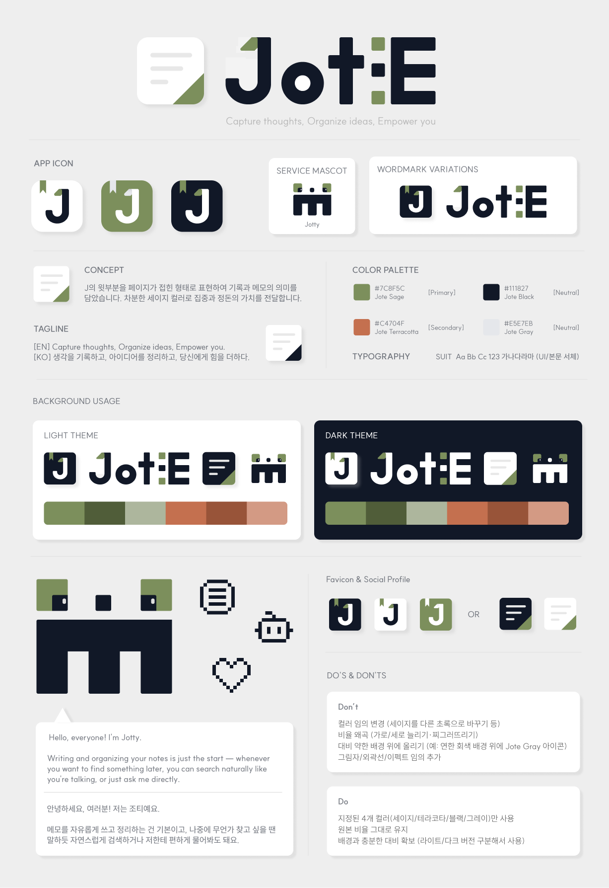

### Jote Docs

개인 프로젝트 **Jote**의 기획 → 설계 → 개발 → 배포 전 과정을 기록하는 문서 저장소

 

**Capture thoughts, Organize ideas, Empower you.**

Jote is a note-taking app that pairs a clean writing experience with AI-powered understanding. Write and organize your notes freely, then find what you need again through natural-language search or a chat that knows your notes.

Jote는 메모 작성부터 정리, 그리고 AI 기반 이해까지 아우르는 메모 앱입니다. 자유롭게 쓰고 정리한 메모를, 자연어 검색과 AI 채팅으로 다시 꺼내 쓸 수 있습니다. 생각을 기록하고, 아이디어를 정리하고, 당신에게 힘을 더합니다.

 

 

**Claude 활용 방식**
- 논의 내용뿐 아니라 두서없이 발산한 생각도 `CLAUDE.md` 규칙에 맞춰 정리된 문서로 구조화
- `~현재 내용 문서 정리`, `~문서 파일 커밋` 트리거 문구로 문서화/커밋 수행